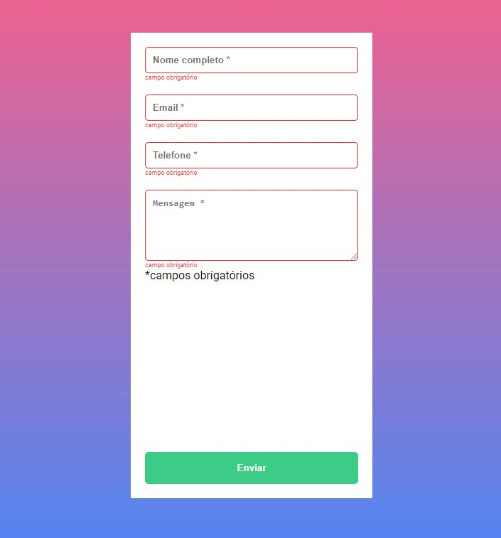

# Validação de Formulário com Javascript

> Projeto que visou validar como obrigatório o preenchimento dos campos de um Formulário.

## Índice

- [Imagem do projeto](#imagem-do-projeto)
- [Repositório do projeto](#repositório-do-projeto)
- [Tecnologias 💻](#tecnologias-💻)
- [O que aprendi 👨🏻‍💻](#o-que-aprendi-👨🏻‍💻)
- [Contato 📩](#contato-📩)

## Imagem do projeto

- Página completa do formulário

- Campos com validação obrigatória

## Repositório do projeto

[🔗 Clique aqui para acessar o projeto](https://github.com/alysson-leite/validacao-formulario-js)

## Tecnologias 💻
- HTML
- CSS
- JavaScript
- Git e Github

## O que aprendi 👨🏻‍💻
Neste projeto aprendi a utilizar Javascript para manipular o DOM inserir elementos no HTML.

## Contato 📩
[alysson_leite@yahoo.com.br](alysson_leite@yahoo.com.br)

[Linkedin](https://www.linkedin.com/in/alysson-leite-14040a239/)

[Github](https://github.com/alysson-leite)